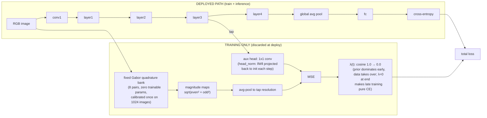
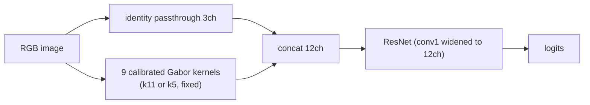
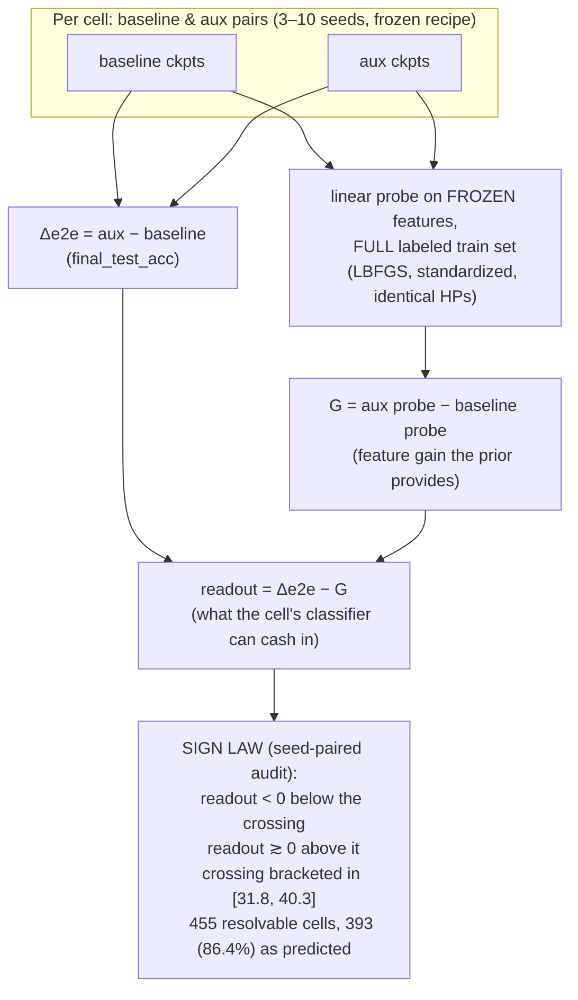
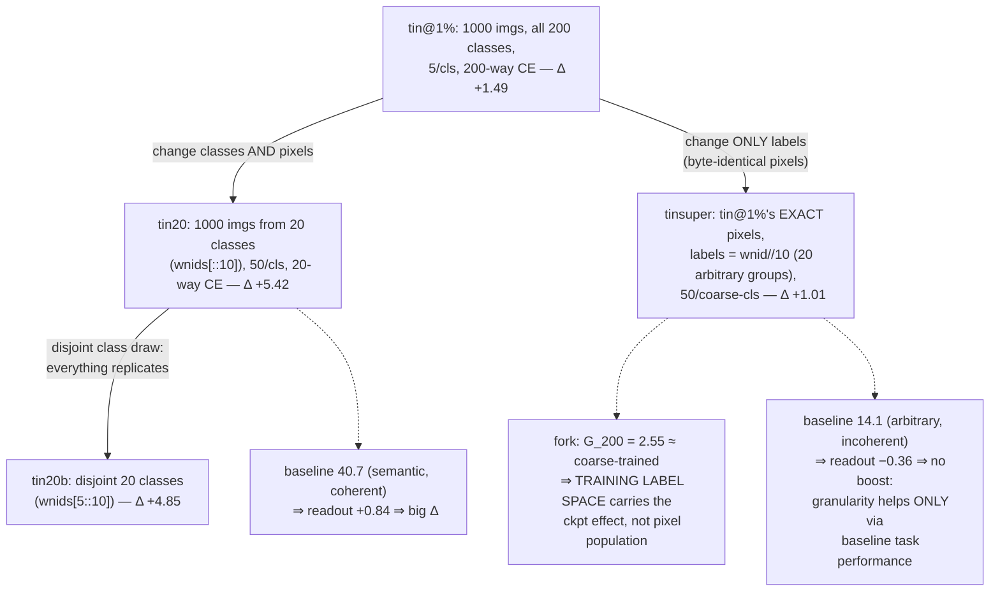
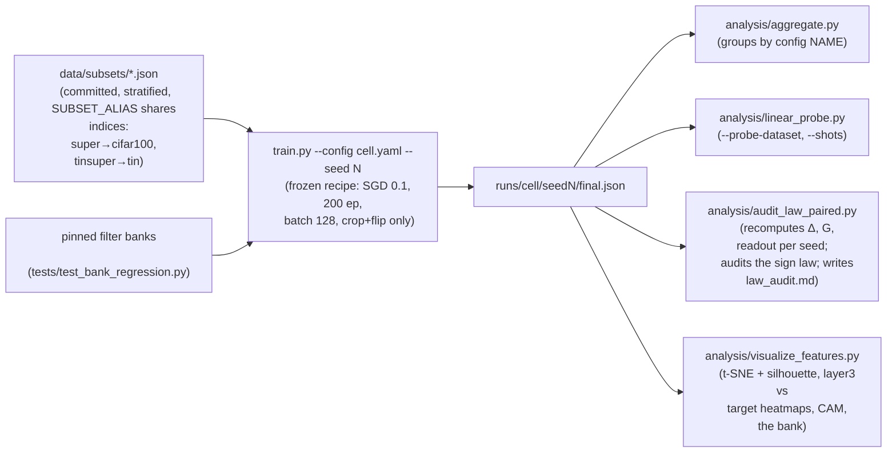

# Architecture & measurement framework

Diagrams for the MomentStem study. GitHub renders the mermaid blocks natively.
Generated figures referenced here live in [viz/](viz/) (see
`analysis/visualize_features.py`).

## 1. MomentAux — the method under test (the paper's reference configuration)

The deployed network is a **vanilla ResNet** (RGB → logits, +0 inference
params). The moment prior exists only as a training-time auxiliary loss.

Key settled design points: tap **layer3** (layer1≈layer2≈layer3 plateau,
layer4 cliff — tap depth is NOT a regime knob), target **magnitude** (beats
structure/steerable/rotinv/gabor/HOG/random/learned-teacher on CIFAR-100;
the ordering compresses on Tiny-ImageNet, where the surviving claim is the
margin over random fixed maps), loss **MSE**
(cosine discards the scale that matters), **λ0 is the data-regime knob**
(2.0 at 1–2%, 1.0 at 3–10%, 0.3 at 15–25%, 0.1 at 100%).

## 2. Forward-path MomentStem (the superseded placement)

Hard input constraint: wins only ≤5% data (energy-magnitude variant: +2.55@1%),
pays a **penalty band** at 10–25% that no variant escapes, washes out at 100%.
MomentAux exists because this placement cannot scale with data.

## 3. The measurement framework — Δ = G + readout

Guard rails: the decomposition is valid only while the probe holds far more
labels than the cell (probe-ceiling rule — stl@20/50% excluded); G is
comparable only within a fixed probe space (the tin 2×2 result); every claim
is machine-checked by `analysis/audit_law_paired.py` (the canonical audit);
`analysis/audit_law.py` is the older closure check and is kept for the record.

## 4. The label-space controls (what moved, what stayed fixed)

## 5. Reproducibility spine

