# Reading the visuals

What each figure in [viz/](viz/) shows, how to read it, and what it
demonstrates about the method. Terms like **λ**, **G**, **readout**, and
**magnitude map** are defined in the [GLOSSARY](GLOSSARY.md). Regenerate any
of them with:

```bash
python analysis/visualize_features.py --pair <baseline_cell> <aux_cell> --out docs/viz
python analysis/training_dynamics.py  --pair <baseline_cell> <aux_cell> --out docs/viz
python analysis/per_class_delta.py    --pair <baseline_cell> <aux_cell> --out docs/viz
```

All checkpoint figures use **seed 0** of each cell and the **test split**
(per-class and dynamics figures use **all seeds**); they are diagnostics,
never headline evidence — the quantitative claims they illustrate are
machine-checked from all seeds by `analysis/audit_law.py`
(current status: **all checks pass**). Every figure shows **human class
names** (CIFAR names, WordNet words for the tin family, CUB species), never
bare class indices.

---

## 1. The prior itself — the Gabor quadrature bank

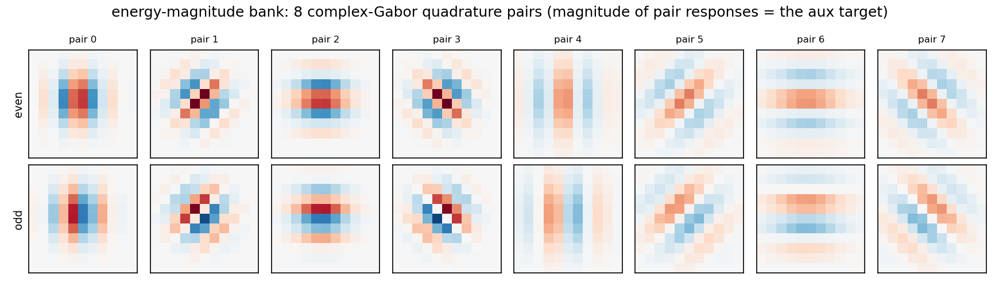

**What it is.** The 8 complex-Gabor quadrature pairs (top row: even/cosine
phase, bottom row: odd/sine phase; red = positive, blue = negative weights)
that define the moment prior. They are **fixed**: zero trainable parameters,
numerically pinned by `tests/test_bank_regression.py`, calibrated once on
1024 images so all channels respond at comparable scale.

**How the target is made.** Each pair is convolved with the image's luma; the
aux target is the per-pair **magnitude** `sqrt(even² + odd²)` — local
oriented energy that is invariant to the phase of the underlying edge. The
target sweep showed this phase-invariant magnitude beats every alternative
(oriented edges, rotation invariants, structure tensors, HOG, learned
teachers, random maps).

---

## 2. What the aux loss does to features — layer3 heatmaps

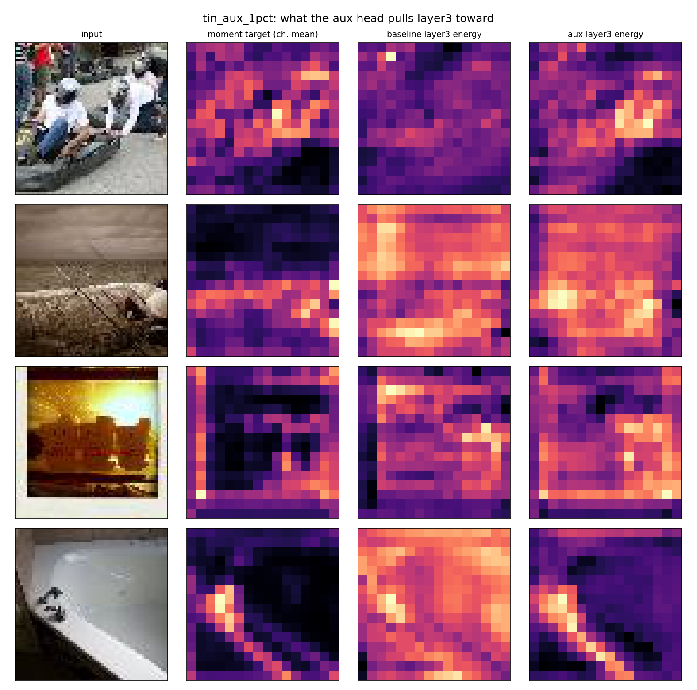

**How to read it.** Rows are **advantage cases**: test images the aux model
classifies correctly and the baseline gets wrong (chosen deterministically —
first such cases in test order). Columns: the input with its **true label**;
the moment-magnitude target (channel mean, pooled to the tap resolution);
the **baseline** model's layer3 energy with its prediction (✗) and its
Pearson correlation r against the target map; the **aux** model's layer3
energy with its prediction (✓) and r. Maps are min–max normalized — compare
spatial structure, and use the r values for the quantitative comparison.

**What it shows.** The suptitle carries the headline number, measured over
512 test images: **mean r(layer3, target) = −0.04 baseline vs +0.49 aux**
(tin@1%). The aux model's layer3 still tracks the moment target at test
time — *after* the aux head is discarded — while the baseline's energy is
uncorrelated with it. Per-row: in the flagpole case the aux map follows the
pole and wings at r=+0.88 (baseline +0.51, predicts "goose"). This is the
mechanism of the auxiliary loss made visible: the 1×1 head can only predict
the target if the tapped features contain it, so SGD shapes them toward it —
and the shaping persists. It is also why the feature gain G exists at
scarcity: at 5 images/class the CE gradient alone cannot teach layer3 where
object structure lives; the prior can.

Alignment across the three visualized pairs (baseline → aux):
tin@1% **−0.04 → +0.49** · C100@5% **+0.22 → +0.53** · tin20 **+0.19 → +0.58**.

Same figure for the champion's peak cell and the granularity control:

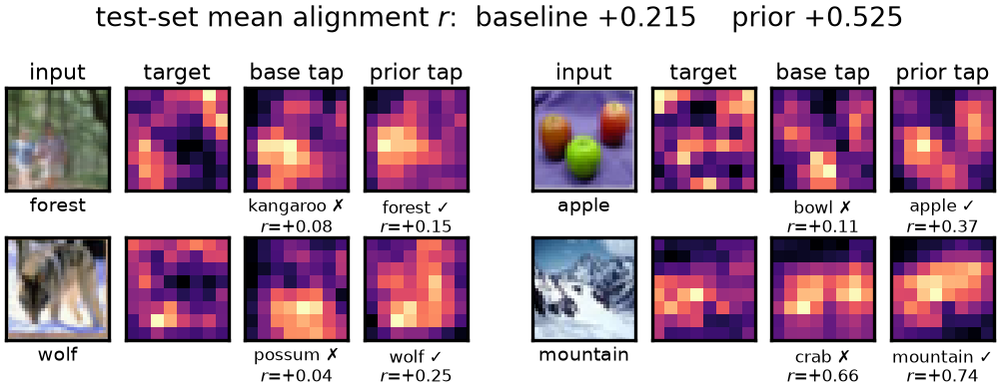
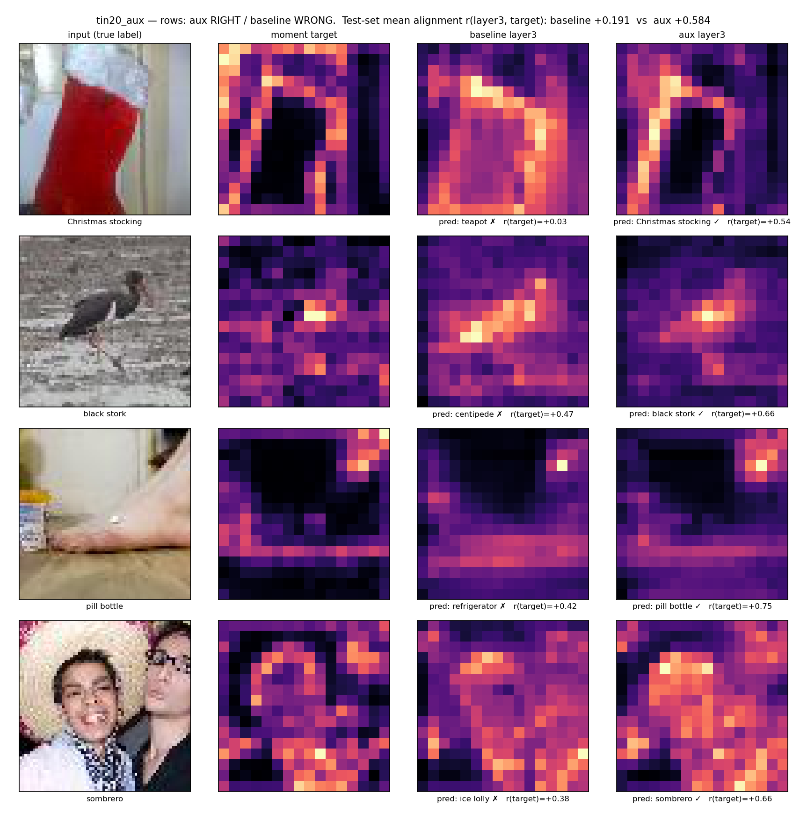

---

## 3. Feature clustering — t-SNE + silhouette

**How to read it.** Penultimate (post-GAP) test features, embedded to 2-D by
t-SNE, colored by class (Okabe–Ito CVD-safe palette; 8 classes shown for
legibility). The panel titles carry the **full-dimensional cosine silhouette
over ALL classes** — that number is the real statement; the 2-D map only
illustrates it.

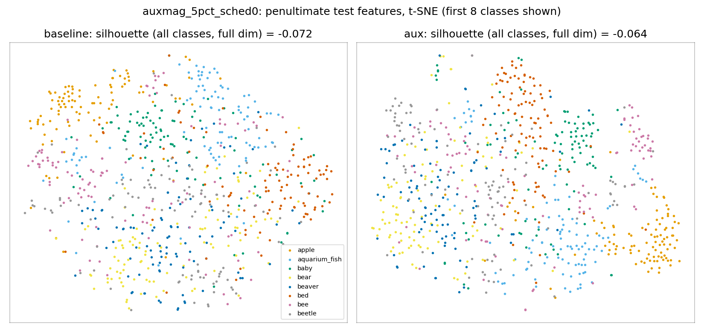

**CIFAR-100@5%** — the champion's peak cell (Δe2e +5.30, G +6.35). The aux
panel shows visibly tighter class islands; silhouette −0.072 → −0.064.

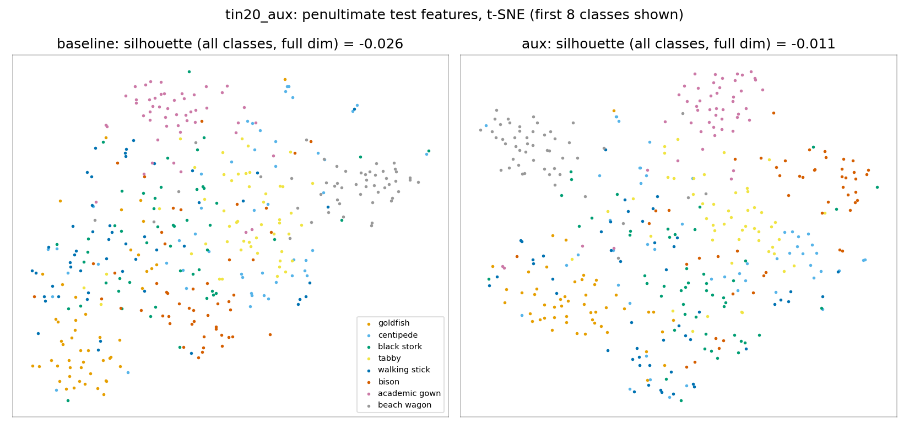

**tin20** (Δ +5.42, G +4.58). Silhouette −0.026 → −0.011; several classes
(pink, gray, orange) crisp up substantially.

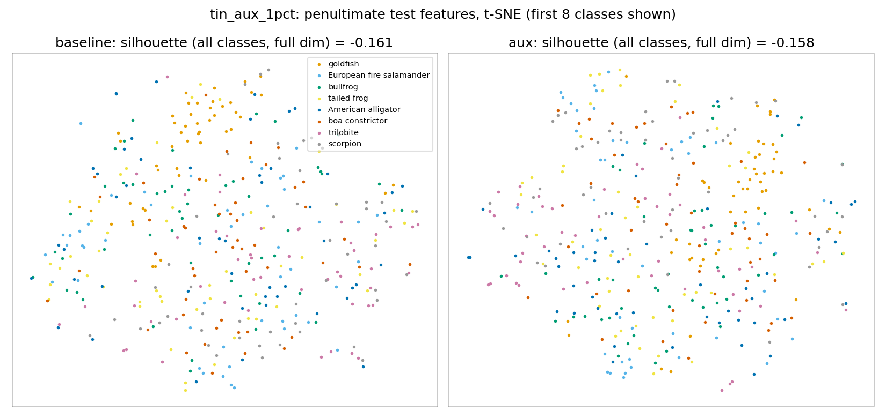

**tin@1%** (Δ +1.49, G +4.19). At a 5.3% baseline *neither* model shows
visible clusters (silhouettes ≈ −0.16, essentially tied) even though the
linear probe measures a large feature gap.

**The cross-figure lesson.** Silhouette moves far less than the linear-probe
gap G in every pair. The prior's gain is **linear readability** of the
features — a probe (or a classifier with enough labels) can separate classes
much better — more than raw cluster geometry. That is exactly the study's
readout law: the same features yield +1.49 end-to-end at a 5-per-class
readout and would yield ~+4 with labels to spare. The left flank of the
envelope is a *readout* limitation, and these plots show what that looks
like in feature space.

---

## 4. Where the classifiers look — class-activation maps

**How to read it.** For GAP→fc ResNets, CAM is exact: the map is the
classifier weight vector of the *predicted* class applied to the final
feature maps, upsampled over the input. Bright = evidence for the
prediction. Rows are the same advantage cases as §2 (aux ✓ / baseline ✗),
each panel labeled with that model's prediction.

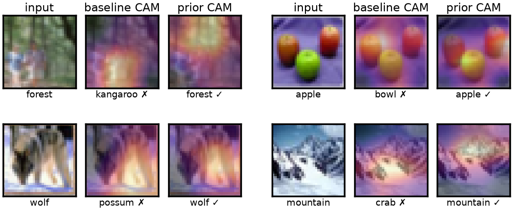
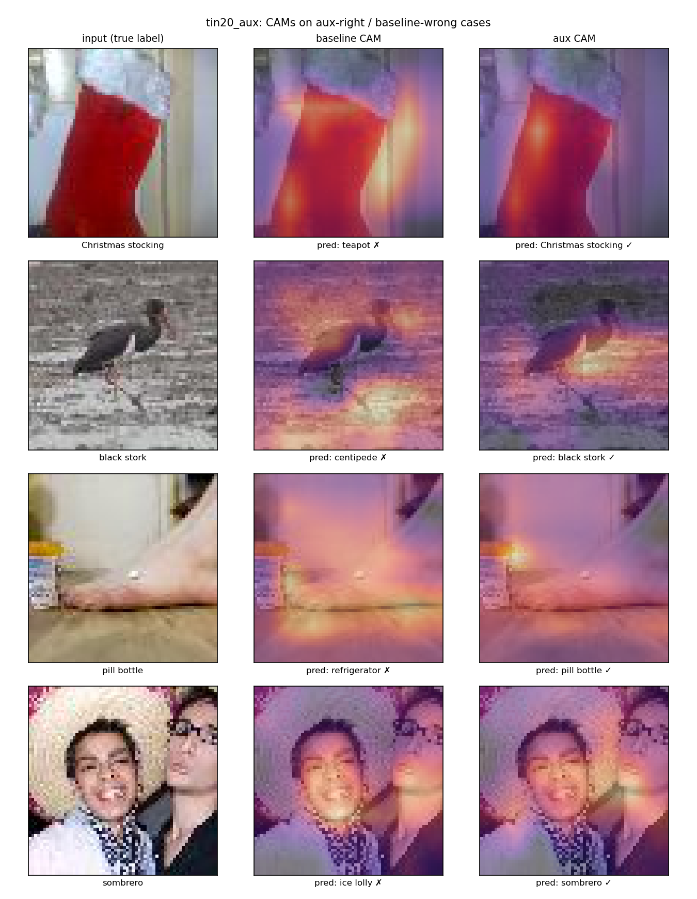
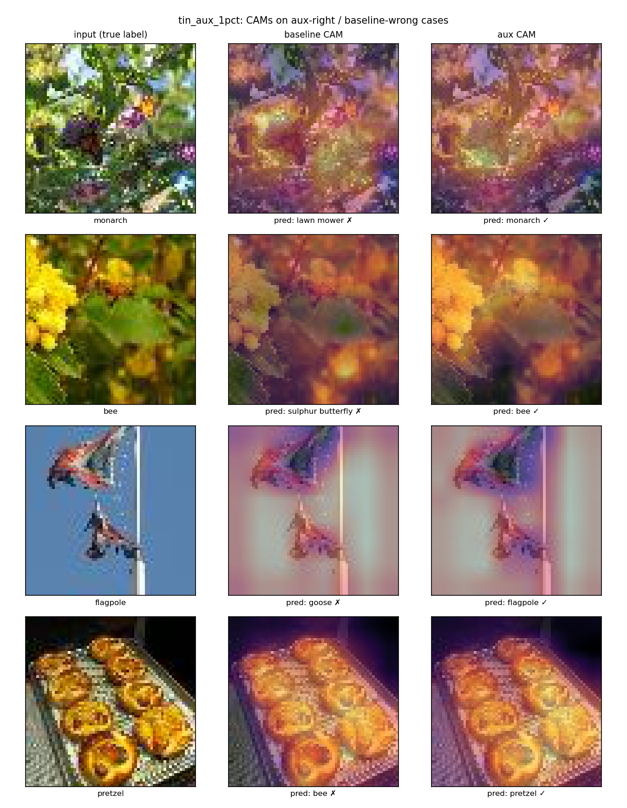

**What it shows.** The aux models' evidence tends to concentrate on object
extent; low-data baselines lean more on context and background. Read
qualitatively only — CAMs explain *predictions*, not accuracy differences.

---

## 5. When the gap opens — training dynamics

**How to read it.** From every seed's `metrics.csv` (thin lines = seeds,
thick = mean): test accuracy and total train loss vs epoch for baseline
(orange) and aux (blue); the **λ(t) cosine schedule** next to the lr
schedule; and, for runs after 2026-07-20, the CE/MSE loss components and
the tapped-feature std (the scale-collapse diagnostic from the R50 trace).

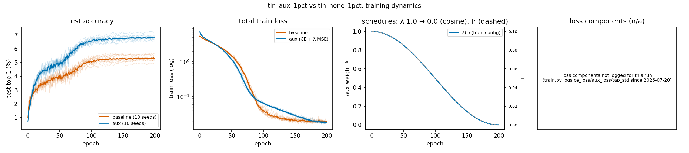

**What it shows (tin@1%).** The aux advantage is not an endgame effect: the
curves separate in the **first ~30 epochs — while λ is still near λ0** —
and the gap then rides unchanged through the pure-CE endphase. That is the
champion schedule's design made visible: the prior does its work early,
when the high learning rate commits features, and λ→0 guarantees the final
model was last shaped by CE alone.

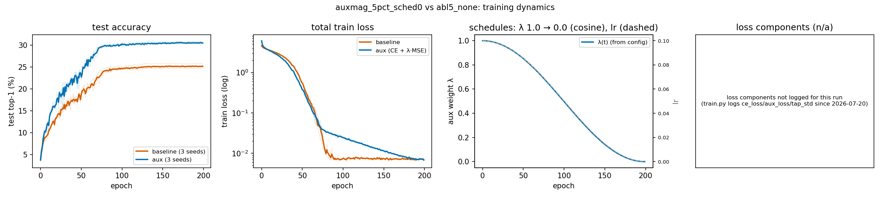
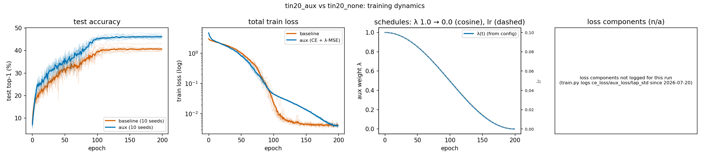

---

## 6. Who gains — per-class deltas

**How to read it.** Per-class test accuracy Δ (aux − baseline) averaged
over **all seed pairs**, whiskers = seed std; blue = most-helped classes,
orange = most-hurt; dashes = the cell's overall Δ. Full table with names in
`runs/<cell>/per_class_delta.json`.

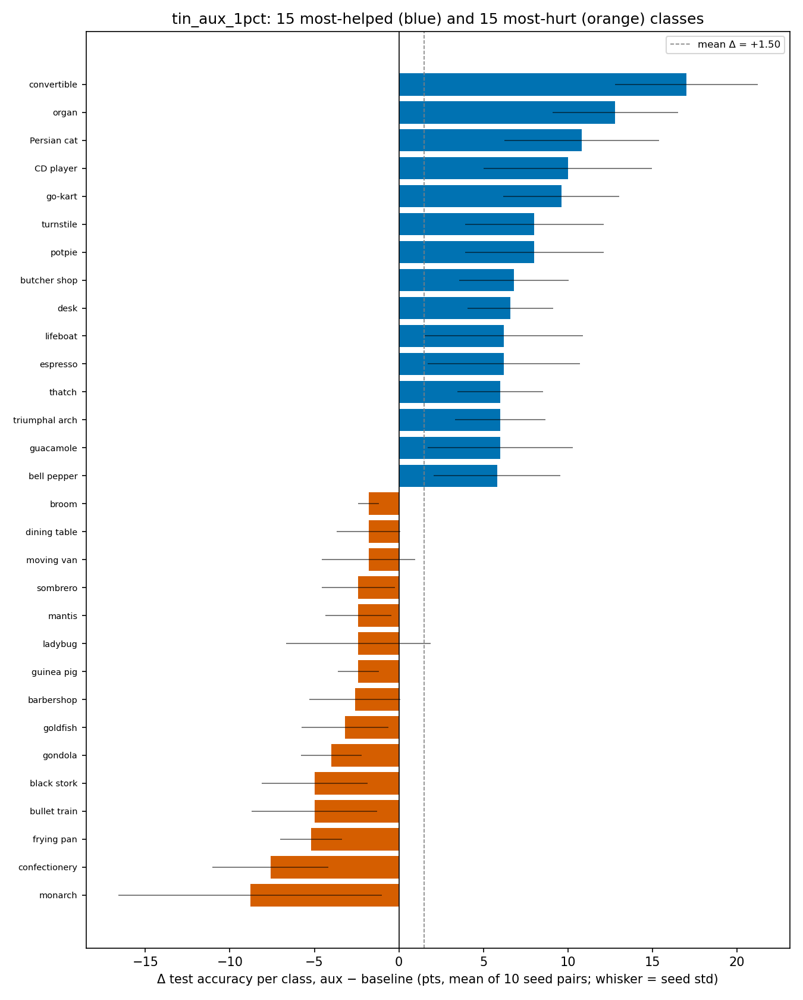

**What it shows (tin@1%).** The +1.49 mean is not uniform: 139/200 classes
gain, led by structure-rich rigid objects (convertible +17), while a
minority lose (monarch −8.8). Read qualitatively — per-class accuracy at
5 img/class is noisy even averaged over 10 seeds — but the asymmetry
(broad moderate gains, few concentrated losses) is the shape a *feature*
prior should produce, as opposed to a calibration trick.

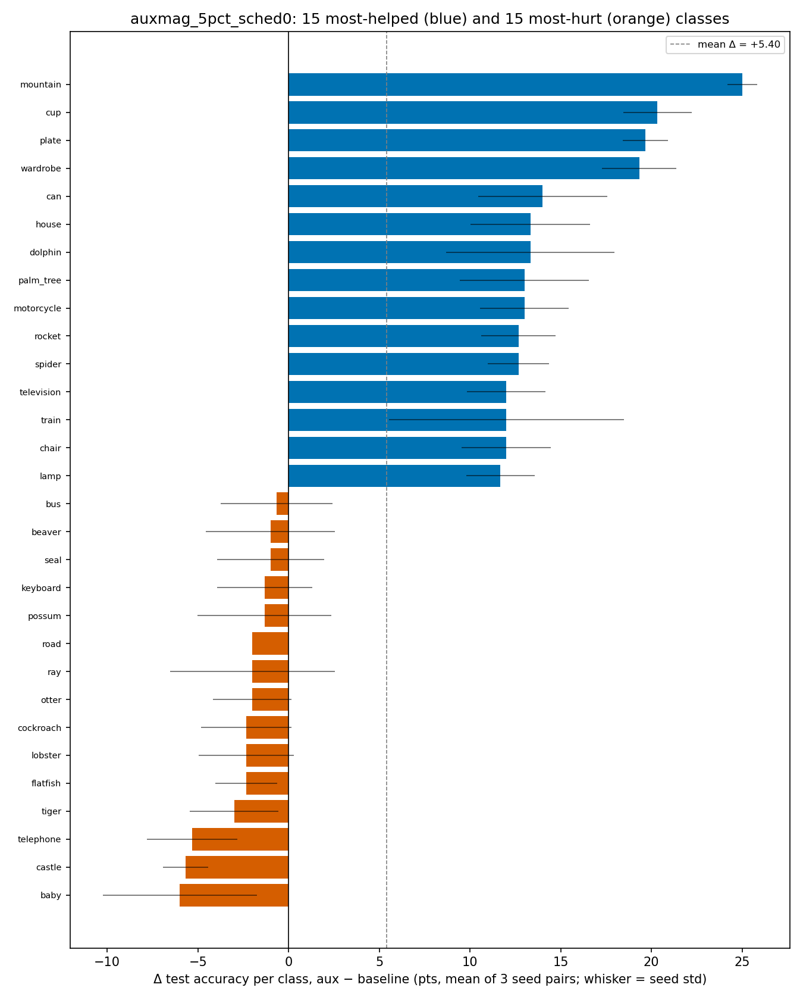
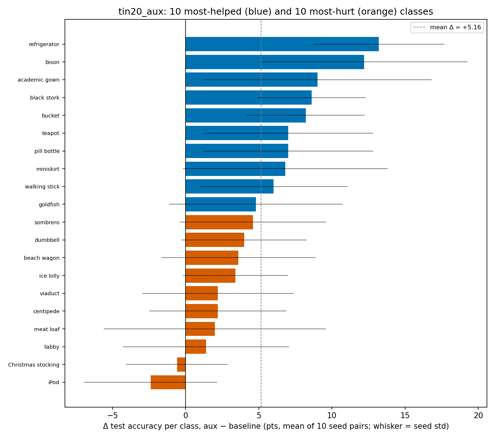

---

## 7. The numbers behind the pictures

The full machine-verified table (every probed pair: baseline, Δe2e, G,
readout) is regenerated by:

```bash
python analysis/audit_law.py   # writes results/law_audit.md, exit 1 on any failed check
```

| figure | cell | Δe2e | G (probe gap) | readout |
|---|---|---|---|---|
| §2, §3, §4 | tin@1% | +1.49 ±0.09 | +4.19 ±0.15 | −2.69 |
| §2, §3, §4 | C100@5% | +5.30 ±0.35 | +6.35 ±0.34 | −1.06 |
| §2, §3, §4 | tin20 | +5.42 ±0.41 | +4.58 ±0.60 | +0.84 |

See [ARCHITECTURE.md](ARCHITECTURE.md) for the diagrams of the training
setup and the measurement framework, and [FINDINGS.md](FINDINGS.md) for the
full question-by-question experimental record.
